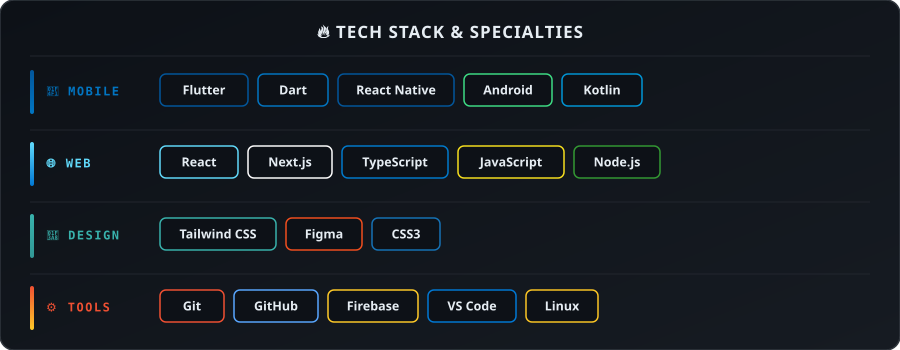
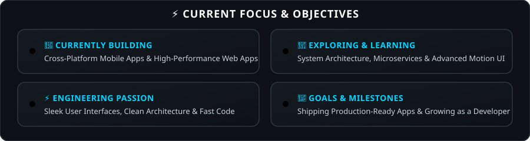

<!-- Animated Header Banner -->

  

<!-- Profile Badges -->

&nbsp;

&nbsp;

---

## 🌌 About Me

<!-- Animated VS Code Terminal Card -->

---

## 🛠️ Tech Stack & Specialties

<!-- Animated Tech Stack Dashboard -->

---

## ⚡ Current Focus & Objectives

<!-- Animated Focus & Objectives Cards -->

---

## 📊 GitHub Analytics & Insights

<!-- Local Stat Cards generated via GitHub Actions -->

  
  &nbsp;
  

 

 

---

## 🐍 Contribution Snake

  <picture>
    <source media="(prefers-color-scheme: dark)" srcset="https://raw.githubusercontent.com/1Nabhan1/1Nabhan1/output/github-contribution-grid-snake-dark.svg"/>
    <source media="(prefers-color-scheme: light)" srcset="https://raw.githubusercontent.com/1Nabhan1/1Nabhan1/output/github-contribution-grid-snake.svg"/>
    
  </picture>

---

## 📫 Let's Connect

<!-- Animated Connect Banner -->

